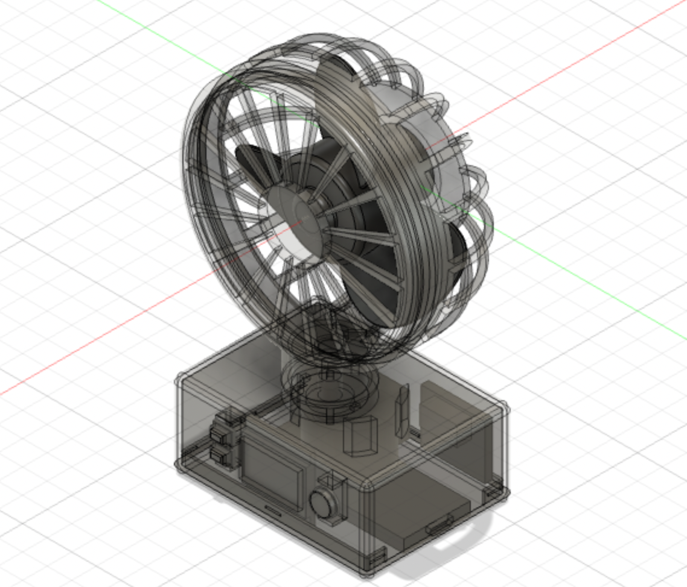
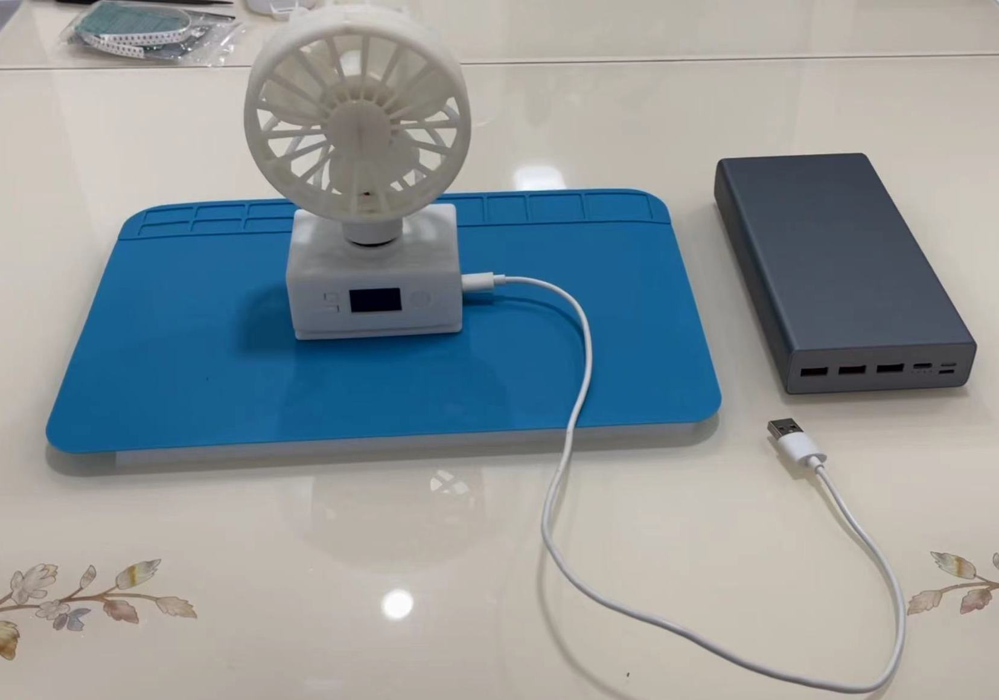

# w806-fan

Hi-Link w806 chipset Demo.

## Material List
|name|num|
|----|----|
|HLK-W806 chipset|1|
|ULN2003 module|1|
|MX1508 module|1|
|28BYJ4-48 5VDC step motor|1|
|280 electric machinery|1|
|0.96" 128x64 OLED|1|
|switch|3|
|slip ring|1|

## Functions
- Speed Control
- Swing Control
- Status Display

## 3D-Model

## Preview

